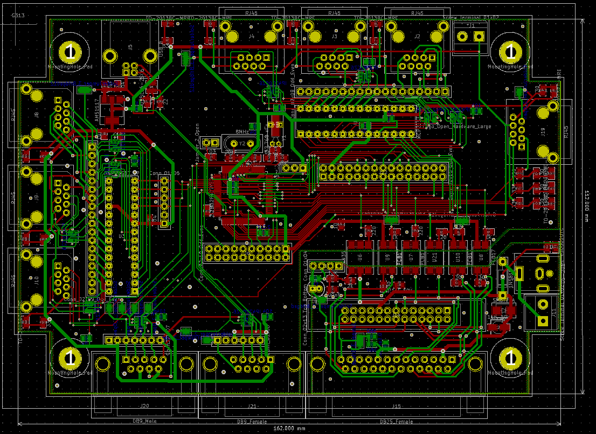
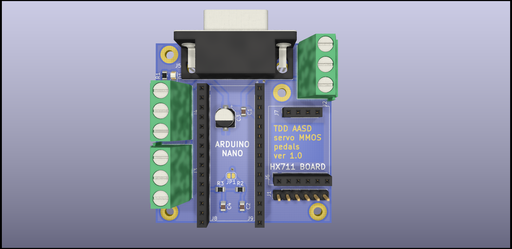

# !!! WARNING !!!

Hey. I'm making 6dof project base of https://github.com/knaufinator/6DOF-Rotary-Stewart-Motion-Simulator/tree/master/Technical

This is a DANGEROUS project, and if absolute care is not taken you will be injured or killed.

Project isn't finished yet. I will place all data to this repo.

# Experiments one

We made PCB from Christopher Knauf:

And we can to control one AC motor driver:

# Projects Included
These are the components of the project that are included in this repository

## Technical 

I made all draws in Kompas 3D. I will make drawings in the future.

This is current project:

## Controller
This is an ESP32 Arduino project. This interfaces with the PC through software like simtools, after correctly configuring. This project utilizes both ESP32 cores in order to maximize refresh rates to 1000Hz, or 1ms interval. A custom MCP23S17 library is included so the outputs of all 6 motors can be set at one time instead of setting them individually, this saves time and allows for more pulses per second. This increase allows for higher movement precision on the rotational arm. There is also a filter library included, this is still in early testing.

## Simtools interface setup
Config for PC to ESP32 USB-> Serial connection within simtools, simtools will be configured to send the 6 axis parameters over to the ESP32 every 1 ms. Over a 250000 baud connection. The packet consists of 6 - 12 bit values, delimited by comma and ended by a "X" Character to signal the ESP32 that the packet is done. 

For simtools you encode the axis representations of x,y,z,Ry,Rx,RZ  with the configuration"Interface - Output" = \<Axis1a>,\<Axis2a>,\<Axis3a>,\<Axis4a>,\<Axis5a>,\<Axis6a>X   

With these settings the software package Simtools or any other custom application may communicate and command the simulator platform to move.

## Controller Schematics

We developed our controller board with optocoupler:

We use sensor bord from Christopher Knauf: 

## Controller PCB

We have a problem with USB interface. We start to do second PCB:

## TDD MMOS PCB

We redesigned PCB for TDD MMOS. We've added optocouplers and second port extender.

## Pedal's PCB

## Platform Test Application
.Net Application for testing position limits and speed of platform. Allows for manual setting of each DOF / Axis. As well works with XBOX360 controller through the PC USB wireless adapter.

# Parts
These are some key parts I used, others can be used in their place, but variations of the AC Servo motor may not be compadible with the PCB, and may require a modified PCB schematic. 

## Electric components

* [AC Ammeter Voltmeter](https://www.aliexpress.com/item/4000589056233.html?spm=a2g0s.9042311.0.0.40e133edW2JAK5)

## Controller 
Main components on the PCB
* [ESP32 Dev board](https://aliexpress.ru/item/1005001267643044.html?spm=a2g0s.9042311.0.0.40e133edW2JAK5) - ESP32 Dev kit
* [MCP23S17-E/SP](https://www.chipdip.ru/product1/8002981432)
* [3.3V to 5V TTL Shifter Module](https://aliexpress.ru/item/32825755943.html?spm=a2g0s.9042311.0.0.40e133edW2JAK5)
* [NJK-5002C NPN NO（Normally Open)Hall Effect Sensor Switch](https://aliexpress.ru/item/32922514991.html?spm=a2g0s.9042311.0.0.40e133edW2JAK5)
* [IDC BOX HEADER 2X13 26PIN](https://aliexpress.ru/item/33009552726.html?spm=a2g0s.9042311.0.0.40e133edW2JAK5)
* [RJ45](https://aliexpress.ru/item/4000226018964.html?spm=a2g0s.9042311.0.0.40e133edW2JAK5)
* [KF301 HEADER 3 pin](https://aliexpress.ru/item/4001057723206.html?spm=a2g0s.9042311.0.0.40e133edW2JAK5)
* [KF301 HEADER 2 pin](https://aliexpress.ru/item/4001057742092.html?spm=a2g0s.9042311.0.0.40e133edW2JAK5)
* [Female Pin Header Connector](https://aliexpress.ru/item/32964870579.html?spm=a2g0s.9042311.0.0.40e133edW2JAK5)

PCB
* [Gerber files](Controller PCB Gerber/)
* [PCB Manufacturer](https://www.rezonit.ru/)

## Base
- Steel plate 8 mm thick 31” diameter
- 6 - Coupler https://amzn.to/2slOiIa

## Drive
* [6 - 750w AC servo Motors](https://www.aliexpress.com/item/32844239563.html)
* [6 - 50:1 Planetary Gears](https://www.aliexpress.com/item/32967571001.html)
*Note ensure planetary gear input diameter matches up to both the motor as well with the coupler output diameter when ordering from Aliexpress

## Connecting Arms

* [12 - Swivel head SA 12mm](https://podtrade.ru/product/42564/)
* [12 - M12 to M10 High Misalignment Angle Reducer Reducers Spacers Rod End Joint](https://www.ebay.com/itm/184116983786)
* 6 - 25x179 Steel pipe

## Swing Arms
* 6 - 25x22mm_clamp2.m3d
* 6 - 25x560 Steel pipe

## Frame 
* 16.5 meters of steel pipe

## Chassis
* [Vesa Monitor mount](https://amzn.to/2TmVS0f)
* [Coped Steel Bungs](https://amzn.to/2TGOcoo)
* [1" OD X .870 ID X .065 Wall Steel tubing](https://amzn.to/3au4FCQ)

## Extras as built in demonstration video
* [LG 34" Ultrawide](https://amzn.to/2t8YvbC)
* [Thrustmaster T16000M FCS](https://amzn.to/30qkHtY)
* [Wind Generator Fan](https://amzn.to/36W1um9)
* [Wind Generator PWM Control](https://amzn.to/2Ns1anq)
* [Wind Generator 90 Degree angle 3"-> 2" Reducer](https://amzn.to/2uN6J9z)
* [Wire Wrap](https://amzn.to/2u3jiNu)

## AC Servo motor settings for 6DoF
These are my settings on the Servo Driver aasd-15a these both enable specific modes as well define the time it should take to accelerate and decelerate the platform before it hits max speed. This is useful for when you want to protect the platform from self destruction due to the fast movements. Make them to large and the platform will feel slugish.
- pn002 - Control Mode - "002" Default
- pn003 - Servo enable - "001"
- pn033 - DSZRtriggermode - "003" Power on automatically
- pn034 - The origin return reference point model - "001" Inversion for REF(rising along the trigger)as a reference point
- pn035 - The origin back to the origin model - "000" Default
- pn036 - The origin position offset high - "011" ten thousand pulse
- pn037 - The origin position offset low - "5000" pulse
- pn038 - The origin back to the first speed - "100" R/min
- pn039 - The origin back to the second speed - "100" R/min
- pn040 - The accelerating time of origin - "050" Default
- pn041 - The origin return to slow down time - "050" Default
- pn042 - The origin in the delay - "100" ms
- pn043 - Complete the signal delay of origin - "080" Default
- pn044 - The origin return instruction execution mode - "000" Default
- pn052 - SigIn1 is "REF" - "023"
- pn053 - SigIn2 is "PSTOP" - "027"
- pn054 - SigIn3 is "PClear" - "019"
- pn055 - SigIn4 is "INH" - "020"
- pn098 - Gear - "80"
- pn109 - Position command deceleration mode- "002"
- pn110 - Position command a filtering time constant - "050"
- pn111 - S-shaped filtering time constant Ta position instruction - "50"
- pn112 - position instruction Ts S-shaped filtering

time constant Ts - "50"

Default settings:
- pn002 - Control Mode - "002"
- pn003 - Servo enable - "000"
- pn033 - DSZRtriggermode - "000"
- pn034 - The origin return reference point model - "000"
- pn035 - The origin back to the origin model - "000"
- pn036 - The origin position offset high - "000"
- pn037 - The origin position offset low - "0000"
- pn038 - The origin back to the first speed - "200" R/min
- pn039 - The origin back to the second speed - "50" R/min
- pn040 - The accelerating time of origin - "050"
- pn041 - The origin return to slow down time - "050"
- pn042 - The origin in the delay - "60" ms
- pn043 - Complete the signal delay of origin - "080"
- pn044 - The origin return instruction execution mode - "000"
- pn052 - SigIn1 is "REF" - "001"
- pn053 - SigIn2 is "PSTOP" - "002"
- pn054 - SigIn3 is "PClear" - "019"
- pn055 - SigIn4 is "INH" - "008"
- pn098 - Gear - "1"
- pn109 - Position command deceleration mode- "001"
- pn110 - Position command a filtering time constant - "050"
- pn111 - S-shaped filtering time constant Ta position instruction - "50"
- pn112 - position instruction Ts S-shaped filtering - "20"

## AC Servo motor settings for Wheel

- PN002 = 0	(control mode - voltage mode, requires restart) (Default:02)
- PN003 = 0	( Servo enabled? - external) (Default:00)
- PN018 = 0	(Take the encoder output pulse AB phase logic - 0-1) (Default:00)
- PN051 = 1500	(Motor max RPM - see motor specs) (Default:3000)
- PN053 = 18? 	(SigIn 2 port functional allocation  -27 - 27) - 58? "command reverse" function number range name
- PN188 = 159	(Analog torque instruction smooth filtering time - 1-500ms) (Default:5)
- PN189 = 39 	(Analog torque instruction gain 1-300 %/V) (Default:30)
- PN190 = 0	(Analog torque instruction offset adjustment  -1.5v - 1.5v) (Default:0)
- PN191 = 1	(Simulation of torque command direction - try 0 first) (Default:0)
- PN198 = 120 	(Torque control speed limit - 0-4500rpm) (Default:2500)
